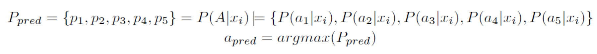

# Eye Direction Detector for mobile devices

## Abstract
Precise prediction of eyes' movement have become important in CV, meanwhile there are more and more HCI projects are devoted into this realm. However, the appearance-based modle is not quite robust in respond to changeable light and environments.

We came upon this project due to the inconvenience of using smart phones in certain situations. E.g. people need to take off gloves to use their smart phone in winter or their hands are busy but need to use the cellphone. Actually, other body gestures like eye movements can also cast a command and people can enjoy hands-free operations.

## Related works
There are two main kinds of ways to detect eye movement which are Model-based detection and Appearance-based detection. Model-based process [1][2] requires instruments such as high-resolution infrared cameras which are usually not installed on cellphones. Considering Appearance-based model, there are more and more researches on CNNs and some showed the results were acceptable. Still, Appearance-models are sensitive to the change of pixel values, which makes the detection hard and inefficient and cannot put into practice.

Appearance-based models are build by a mapping relationship between pixel values and eyes' properties. Some applied old-fashion ways like Haar wavelet and SVM to classify images of eyes [4]. Recently, due to the improvement of computational ability, neuron networks are available and people tend to use CNNs to tackle CV problems. [5] used cascaded models to predict the position of pupils. [10] took advantage of Viola-Jones algorithm to find human eyes' position and classified them into 9 directions. Based on those researches, we designed a computational process to achieve this complex task.

## Methods
To make the abstract problem concrete, we introduced the input-output relationship below. The input vector X={x|x1,x2,...xn is a 3-d tensor with size Width\*Height\*3} represents the images the camera took and the output space A={a1,a2,a3,a4,a5} represents different instructions user gave. Our goal is to build the mapping from X to A. Assume P_pred is the probability the user took a certain action in action space, then we have:

The workflow is shown below. We splited this complicated mapping into two sub-parts. The first one is responsible for finding the eyes' position and classifying them as right eyes or left eyes. We will at first propose N candidate regions and train a classifier to cataglorize them into right eye, left eye or not eye. The second part then takes the information (cropped images and labels) received from the first part. And we will train the second network to build the mapping from cropped images to actions of the user.

#### Region Proposal

#### Eye Region Determination and Classification

#### Eye Movement Classification

## Training

#### Feature Points Selection

#### Dataset

#### Data Augmentation

## Experiments

#### Eye Detection and Classification

#### Eye Movement Classification

## Conclusion

## References
[1] P. Majaranta and A. Bulling, “Eye tracking and eye-based human–computer interaction,” in Advances in physiological computing. Springer, 2014, pp. 39–65  
[2] C. H. Morimoto, A. Amir, and M. Flickner, “Detecting eye position and gaze from a single camera and 2 light sources,” in Pattern Recognition, 2002. Proceedings. 16th International Conference on, vol. 4. IEEE, 2002, pp. 314–317  
[3] X. Zhang, Y. Sugano, M. Fritz, and A. Bulling, “Appearance-based gaze estimation in the wild,” in Proceedings of the IEEE Conference on Computer Vision and Pattern Recognition, 2015, pp. 4511–4520.  
[4] S. Chen and C. Liu, “Eye detection using discriminatory Haar features and a new efficient SVM,” Image and Vision Computing, vol. 33, pp. 68–77, 2015.  
[5] Girshick, R., Donahue, J., Darrell, T., Malik, J.: Rich feature hierarchies for accurate object detection and semantic segmentation. In: Conference on Computer Vision and Pattern Recognition, pp. 580–587. IEEE (2014)  
[6] Bin Li & Hong Fu (2017) Real Time Eye Detector with Cascaded Convolutional Neural Networks Applied Computational Intelligence and Soft Computing, vol. 2018, Article ID 1439312, 8 pages, 2018. https://doi.org/10.1155/2018/1439312.  
[7] J. Lemley. & A. Kar, A. Drimbarean & P. Corcoran (2018) Efficient CNN Implementation for Eye-Gaze Estimation on Low-Power/Low-Quality Consumer Imaging Systems (arXiv:1806.10890)  
[8] O. Jesorsky, K. J. Kirchberg, and R. W. Frischholz, “Robust face detection using the hausdorff distance,” in Audio- and Video-Based Biometric Person Authentication: Third International Conference, AVBPA 2001 Halmstad, Sweden, June 6–8, 2001 Proceedings, J. Bigun and F. Smeraldi, Eds., vol. 2091 of Lecture Notes in Computer Science, pp. 90–95, Springer, Berlin, Germany, 2001  
[9] A. Villanueva, V. Ponz, L. Sesma-Sanchez, M. Ariz, S. Porta, and R. Cabeza, “Hybrid method based on topography for robust detection of iris center and eye corners,” ACM Transactions on Multimedia Computing, Communications, and Applications (TOMM), vol. 9, no. 4, article 25, 2013.  
[10] C. Zhang, R. Yao, and J. Cai, “Efficient eye typing with 9-direction gaze estimation,” Multimedia Tools and Applications, Nov 2017. [Online]. Available: https://doi.org/10.1007/s11042-017-5426-y  
