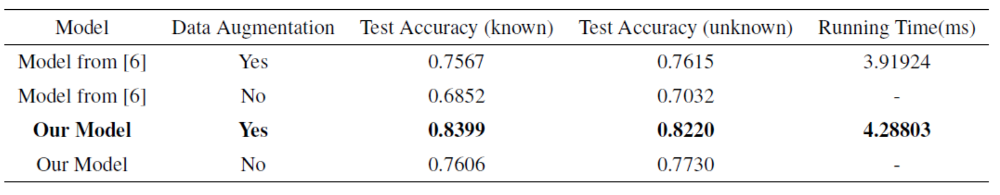

# Eye Direction Detector for mobile devices

## Abstract
Precise prediction of eye movement have become important in CV, meanwhile there are more and more HCI projects are devoted into this realm. However, the appearance-based modle is not quite robust in respond to changeable light and environments.

We came upon this idea due to the inconvenience of using smart phones in some situations. E.g. people need to take off gloves to use their smart phone in winter or their hands are busy but need to use the cellphone. Actually, other body gestures like eye movements can also cast a command and people can enjoy hands-free operations.

## Related works
There are two main kinds of ways to detect eye movement which are Model-based detection and Appearance-based detection. Model-based process [1][2] requires instruments such as high-resolution infrared cameras which are usually not installed on cellphones. Considering Appearance-based model, there are more and more researches on CNNs and some showed the results were acceptable. Still, Appearance-models are sensitive to the change of pixel values, which makes the detection hard and inefficient and cannot put into practice.

Appearance-based models are build by a mapping relationship between pixel values and eyes' properties. Some applied old-fashion ways like Haar wavelet and SVM to classify images of eyes [4]. Recently, due to the improvement of computational ability, neuron networks are available and people tend to use CNNs to tackle CV problems. [5] used cascaded models to predict the position of pupils. [10] took advantage of Viola-Jones algorithm to find human eyes' position and classified them into 9 directions. Based on those researches, we designed a computational process to achieve this complex task.

## Methods
To make the abstract problem concrete, we introduced the input-output relationship below. The input vector X={x|x1,x2,...xn is a 3-d tensor with size Width\*Height\*3} represents the images the camera took and the output space A={a1,a2,a3,a4,a5} represents different instructions user gave. Our goal is to build the mapping from X to A. Assume P_pred is the probability the user took a certain action in action space, then we have:

The workflow is shown below. We splited this complicated mapping into two sub-parts. The first one is responsible for finding the eyes' position and classifying them as right eyes or left eyes. We will at first propose N candidate regions and train a classifier to cataglorize them into right eye, left eye or not eye. The second part then takes the information (cropped images and labels) received from the first part. And we will train the second network to build the mapping from cropped images to actions of the user.

#### Region Proposal

Convolution on the whole image, say image with size 540*960, requires large computational resources and make real-time detection impossible. [10] use Viola and Jones’ face detector to find features on faces fast. However, the downside of this method is that occulsions often make detection failed. Hence, instead of taking advantage of features on faces, we can predict possible eye regions with outlines of human's faces. Mentioned in [7], the outlines on our eyes lid and pupils are clear. As a result, we can extract those lines as references for precise prediction. First, we convolved the images using three Gaussian kernels with different standard deviations and got Gaussian three images. After that, we convolved those Gaussian images with Sobel kernels to get the outlines. Now, we have 3 outline images in respect to different clearity based on one frame. We then used a 5\*5 window to slide over the image. If the pixel value on the second outline image is the maximum over the 5\*5\*3 pixel values, we picked it as a candidate point.

M points will be collected after the operation mentioned above. We sorted over those M points and get N points with largest pixel values. Larger the number N is, heavier overhead we will get when classifying them. The selection of N value depends on the precision and the running time. To find the optimum value, we did some trials over different N value (N=50,100,150,200,250). The results indicated that N=200 was the knee point and we picked it as the number of candidate points.

#### Eye Region Determination and Classification

Because of the unfixed size of the users' eyes, we cropped 3 images (12\*24,18\*36,24\*48) according to each candidate point in respond to different distance between the device and the user. Also, we used a 3-channel CNN to classify those proposed regions and chose the one with largest logit value as output.

The architecture is shown below. The convolution layers are with filter size=3\*3, stride=2 and the depth is 64. Each layer is followed by Batch normalization layer and using Relu as activation function. Also, pooling layers are applied, and the sizes are all 2\*2 with stride 3, 1 and 1 in correspond to those three layers.

#### Eye Movement Classification

We will get at most 2 images with labels from the first CNN. On the second CNN, our goal is to collect the features of right eyes and left eyes. Finally, combine all the infomation and predict the user's command.

The architecture is almost the same as the first CNN. The convolution layers are with filter size=3\*3, stride=2 and the depth is 64. Each layer is followed by Batch normalization layer and using Relu as activation function. Also, pooling layers are applied, and the sizes are all 2\*2 with stride 3, 1 and 1 in correspond to those three layers.

## Training

#### Dataset

Training was done on our dataset. The motivation of collecting dataset by ourselves lies in the inapplicability of benchmark datasets -- BioID and GI4E, which are lack of occlusion and variable light and environment. We collect 249 videos from 33 people, and split them into 3 parts -- training set, test set (known), test set (unknown). To simulate real situation, test set (unknown) is collected from users that are not appeared in training set.

#### Data Augmentation

To enlarge our dataset and enhance the robustness of the model, we applied some data augmentation methods. Rotating the images is the first, we rotated the image in -8,-5,5,8 degrees and cropped as new training data. Secondly, we applied +-5 displacement on our training images. Most importantly, we selected 5 different HSV adjustment to enhance the robustness over different light condition. We have 493902 trainig images on the first neuron networks and 344100 ones on the second.

## Experiments

The experiemts ran on Intel(R) Xeon(R) CPU E5-2682 v4 @ 2.50GHz with NVIDIA GeForce GTX 1080 GPU, and we use python 3.6.8 and tensorflow 1.12.0 as the libraries.

#### Eye Detection and Classification

The Comparison between the model from [6] and our model is shown below.

We did some comparison on our algorithm and OpenCV. The Table and screenshots below indicated the precision on test set (unknown). Obviously, both are not ideal. However, our model is not based on features on faces, so even if there are occlusions on faces we can also detect correctly.  

#### Eye Movement Classification

The Comparison between the model from [10] and our model is shown below.

## Conclusion

(1) we setup a complete dataset including 249 videos from 33 people. The characteristics of our dataset are the occlusions on faces and the variable light condition. In comparason to benchmark dataset, we focus on the applicability for mobile devices.  
(2) we built a computational process including the refinement on the region proposal mentioned in [7] and the classifier in [10].  
(3) we designed 3 different data augmentation methods and proof its efficacy by our experiments.

## References

[1] P. Majaranta and A. Bulling, “Eye tracking and eye-based human–computer interaction,” in Advances in physiological computing. Springer, 2014, pp. 39–65  
[2] C. H. Morimoto, A. Amir, and M. Flickner, “Detecting eye position and gaze from a single camera and 2 light sources,” in Pattern Recognition, 2002. Proceedings. 16th International Conference on, vol. 4. IEEE, 2002, pp. 314–317  
[3] X. Zhang, Y. Sugano, M. Fritz, and A. Bulling, “Appearance-based gaze estimation in the wild,” in Proceedings of the IEEE Conference on Computer Vision and Pattern Recognition, 2015, pp. 4511–4520.  
[4] S. Chen and C. Liu, “Eye detection using discriminatory Haar features and a new efficient SVM,” Image and Vision Computing, vol. 33, pp. 68–77, 2015.  
[5] Girshick, R., Donahue, J., Darrell, T., Malik, J.: Rich feature hierarchies for accurate object detection and semantic segmentation. In: Conference on Computer Vision and Pattern Recognition, pp. 580–587. IEEE (2014)  
[6] Bin Li & Hong Fu (2017) Real Time Eye Detector with Cascaded Convolutional Neural Networks Applied Computational Intelligence and Soft Computing, vol. 2018, Article ID 1439312, 8 pages, 2018. [Online]. Available: https://doi.org/10.1155/2018/1439312.  
[7] J. Lemley. & A. Kar, A. Drimbarean & P. Corcoran (2018) Efficient CNN Implementation for Eye-Gaze Estimation on Low-Power/Low-Quality Consumer Imaging Systems (arXiv:1806.10890)  
[8] O. Jesorsky, K. J. Kirchberg, and R. W. Frischholz, “Robust face detection using the hausdorff distance,” in Audio- and Video-Based Biometric Person Authentication: Third International Conference, AVBPA 2001 Halmstad, Sweden, June 6–8, 2001 Proceedings, J. Bigun and F. Smeraldi, Eds., vol. 2091 of Lecture Notes in Computer Science, pp. 90–95, Springer, Berlin, Germany, 2001  
[9] A. Villanueva, V. Ponz, L. Sesma-Sanchez, M. Ariz, S. Porta, and R. Cabeza, “Hybrid method based on topography for robust detection of iris center and eye corners,” ACM Transactions on Multimedia Computing, Communications, and Applications (TOMM), vol. 9, no. 4, article 25, 2013.  
[10] C. Zhang, R. Yao, and J. Cai, “Efficient eye typing with 9-direction gaze estimation,” Multimedia Tools and Applications, Nov 2017. [Online]. Available: https://doi.org/10.1007/s11042-017-5426-y  
