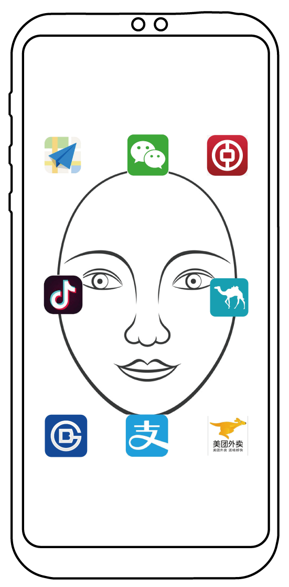

# Eye Direction Detector for mobile devices

## Abstract
According to the statistical data from Apple, people open their cellphones roughly 80 times per day. This is a huge number that people actually spend approximately 400 seconds (80 times \* 4 seconds) per day accessing their cellphones. To reduce the access time, considering security issues, we could not simply remove the screen lock, and instead we add some mechanisms to the lock. Specifically, we came upon the solution that combines face recognition and face ID systems to provide us a short cut to access applications. Without the time of transition from screen lock page to main page and to point a icon, it provides not only convenience but efficacy. When people open their cellphones, their faces would be displayed surrounded by icons of applications. Simply moving eyes in the direction of the app intened to open, people can fast access the app without the overhead of transition.

This project is focused on the part in technical level. The goal is to design an algorithm by which we could detect the eye-movement on an input image. precise detection is quite difficult since the appearance-based modle is not quite robust in respond to changeable light conditions and environments.

## Related works
There are two popular ways to detect eye movement which are called model-based detection and appearance-based detection respectively. model-based process [1][2] requires instruments such as high-resolution infrared cameras which are usually not installed on cellphones, while things are favorable toward appearance-based models which require no extra instrumnet, and also there are more and more researches dived into CNNs and some results showed that appearance-based models were theoretically acceptable in term of its accuracy. Still, Appearance-based models are sensitive insofar as diminutive fluctuation on pixel values might make the prediction totally different, which makes the detection inefficient and hardly can be put into practice.

Appearance-based models are build by the mapping relationship between pixel values and eyes' properties. Some applied old-fashion ways like Haar wavelet and SVM to classify images of eyes [4]. Recently, due to the improvement of computational ability, methods with neuron networks are available and thus people tend to use CNNs to tackle CV problems. For example, [5] used cascaded models to predict the position of pupils, [10] took advantage of Viola-Jones algorithm to find human eyes' position and classified them into 9 directions. Based on those researches, we designed a computational process to achieve this complex task.

## Methods
To make the abstract problem clear, we introduced the input-output relationship below. The input vector X={x|x1,x2,...xn is a 3-d tensor with size Width\*Height\*3} represents the images gathered by the cellphone camera and the output set A={a1,a2,a3,a4,a5} represents different instructions that user gave. Our goal is to build the mapping relationship from X to A. Assume P_pred is the probability that the user took a certain action of action space, then we have:

The workflow is shown below. We splited this complicated mapping relationship into two sub-parts. The first one is responsible for finding the eyes' position and classifying them as right eyes or left eyes. We will propose N candidate regions first and train a classifier to cataglorize them into right eye, left eye or not eye. The second part takes the information (cropped images and labels) received from the first part to predict the actions.

#### Region Proposal

Convolution on the whole image, say image with size 540\*960, requires large computational resources and is impossible when it comes to real-time detection. [10] used Viola and Jones’ face detector to find features on faces fast. However, the downside of this method is that occulsions often make detection failed. Hence, instead of taking advantage of features on the faces, we can predict possible eye regions with outlines of human's faces. Mentioned in [7], the outlines of human's eye lids and pupils are distinctly dark and easily detected. As a result, we can extract those lines as references for precise prediction. First, we convolve the images using three Gaussian kernels with different standard deviations and get three Gaussian images. After that, we convolve those Gaussian images with Sobel kernels to get the images with clear outlines. Now, we have 3 outline images in respect to different clearity based on one frame. We then used a 5\*5 window to slide over the image. If the pixel value on the second outline image is the maximum over the 5\*5\*3 pixel values, we picked it as a candidate point.

M points will be collected after the operation mentioned above. We sorted over those M points and get N points with largest pixel values. Larger the number N is, heavier overhead we will get when classifying them. The selection of the value of N depends on the accuracy and the running time. To strike the balance and find the optimum value, we did some trials over 5 different N value (N=50,100,150,200,250), and the results indicated that N=200 is the knee point which is the representation of desirable candidate points.

#### Eye Region Determination and Classification

Because the size of the users' eyes is variable, we cropped 3 images (12\*24, 18\*36, 24\*48) according to each candidate point in respond to different distances between the device and the user. Also, we adopted a 3-channel CNNs to classify those proposed images and chose the one with the largest logit value as the output.

The architecture is shown below. The convolution layers are with filter size=3\*3, stride=2 and the depth is 64. Each layer is followed by Batch normalization layer and using Relu as activation function. Also, pooling layers are applied, and the kernel sizes are all 2\*2 with stride 3, 1 and 1 respectively.

#### Eye Movement Classification

We would get at most 2 images with labels from the first CNNs, and at the stage, we take advantage of the second CNNs to collect the features of right eyes and left eyes. Finally, combine all the information and predict the command made by the user. The architecture is almost the same as the first CNNs. The convolution layers are with filter size=3\*3, stride=2, depth=64. Each layer is followed by a Batch normalization layer and Relu as activation function. Also, pooling layers are applied, and the kernel sizes are all 2\*2 with stride 3, 1 and 1 respectively.

## Training

#### Dataset

Training and testing were done on our dataset. The motivation of collecting our own dataset lies in the inapplicability of canonical datasets -- BioID and GI4E, which are lack of occlusions and variable light conditions. We collected 249 videos from 33 people, and split them into 3 parts -- training set, test set (known), test set (unknown). To simulate real situation, test set (unknown) is collected from users that are not appeared in training set.

#### Data Augmentation

To enlarge our dataset and enhance the robustness of the model, we applied some data augmentation methods. Rotating the images is one of them -- we rotated the images in -8,-5,5,8 degrees and cropped them as new training data. Also, we applied +-5 displacement on our training images. Most importantly, we selected 5 different sets of HSV adjustment to enhance the robustness. Ultimately, there are 493902 training images on the first training set and 344100 training images on the second training set.

## Experiments

The experiemts were conducted on Intel(R) Xeon(R) CPU E5-2682 v4 @ 2.50GHz with NVIDIA GeForce GTX 1080 GPU, and we used python 3.6.8 and tensorflow 1.12.0 as the libraries.

#### Eye Detection and Classification

The Comparison between the model from [6] and our model is shown below.

The Table and screenshots below indicate the difference in terms of capability of localizing eyes between our model and the model from OpenCV on test set (unknown). Both of the models worked awkwardly on most of the testcases, which, on the one hand, represented the incapability of the models, but on the other hand standed for how throny as we detect objects in a changeable environment. However, to broadly state that the both are equally bad is not precise. Theoretically, our model detects eyes based on the gradient points rather than features on the faces, unlike algorithms related to Haar-like features (OpenCV), so even if there are occlusions on faces we can also detect correctly.

#### Eye Movement Classification

The Comparison between the model from [10] and our model is shown below.

#### Evaluation
The two networks were concated and examined with test set (known and unknown). The results are shown below. We added a "Resizer" between the two networks to prevent overly confident prediction. Specifically, Resizer cropped 20\*30, 28\*42 and 36\*54 images based on the candidate points. Also it would shrink back to the original size -- 12\*24, 18\*36 and 24\*48 -- and feed them into the second network.

## Conclusion

(1) we setup a complete dataset including 249 videos from 33 people. The images of our dataset feature occlusions on faces and variable light condition. In comparison to canonical dataset, we focus on the applicability for mobile devices.  
(2) we built a computational process including the refinement on the region proposal method mentioned in [7] and the eye-direction classifier in [10].  
(3) we designed some data augmentation methods and proved them of use through experiments.

## Download The Dataset

> Thank Song Zheng-qin (CS major student in THU) and Zhang Ke-zhen (CS major student in THU) for assiting in collecting and labelling the data.

https://drive.google.com/file/d/1Ml1HEfVP628K-u3FS8LkobLbM3huANyj/view?usp=sharing

## References

[1] P. Majaranta and A. Bulling, “Eye tracking and eye-based human–computer interaction,” in Advances in physiological computing. Springer, 2014, pp. 39–65  
[2] C. H. Morimoto, A. Amir, and M. Flickner, “Detecting eye position and gaze from a single camera and 2 light sources,” in Pattern Recognition, 2002. Proceedings. 16th International Conference on, vol. 4. IEEE, 2002, pp. 314–317  
[3] X. Zhang, Y. Sugano, M. Fritz, and A. Bulling, “Appearance-based gaze estimation in the wild,” in Proceedings of the IEEE Conference on Computer Vision and Pattern Recognition, 2015, pp. 4511–4520.  
[4] S. Chen and C. Liu, “Eye detection using discriminatory Haar features and a new efficient SVM,” Image and Vision Computing, vol. 33, pp. 68–77, 2015.  
[5] Girshick, R., Donahue, J., Darrell, T., Malik, J.: Rich feature hierarchies for accurate object detection and semantic segmentation. In: Conference on Computer Vision and Pattern Recognition, pp. 580–587. IEEE (2014)  
[6] Bin Li & Hong Fu (2017) Real Time Eye Detector with Cascaded Convolutional Neural Networks Applied Computational Intelligence and Soft Computing, vol. 2018, Article ID 1439312, 8 pages, 2018. [Online]. Available: https://doi.org/10.1155/2018/1439312.  
[7] J. Lemley. & A. Kar, A. Drimbarean & P. Corcoran (2018) Efficient CNN Implementation for Eye-Gaze Estimation on Low-Power/Low-Quality Consumer Imaging Systems (arXiv:1806.10890)  
[8] O. Jesorsky, K. J. Kirchberg, and R. W. Frischholz, “Robust face detection using the hausdorff distance,” in Audio- and Video-Based Biometric Person Authentication: Third International Conference, AVBPA 2001 Halmstad, Sweden, June 6–8, 2001 Proceedings, J. Bigun and F. Smeraldi, Eds., vol. 2091 of Lecture Notes in Computer Science, pp. 90–95, Springer, Berlin, Germany, 2001  
[9] A. Villanueva, V. Ponz, L. Sesma-Sanchez, M. Ariz, S. Porta, and R. Cabeza, “Hybrid method based on topography for robust detection of iris center and eye corners,” ACM Transactions on Multimedia Computing, Communications, and Applications (TOMM), vol. 9, no. 4, article 25, 2013.  
[10] C. Zhang, R. Yao, and J. Cai, “Efficient eye typing with 9-direction gaze estimation,” Multimedia Tools and Applications, Nov 2017. [Online]. Available: https://doi.org/10.1007/s11042-017-5426-y  
